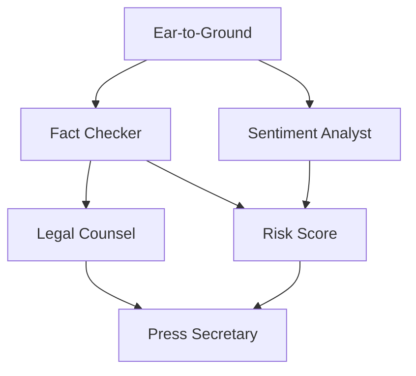

# Agent Specifications - Orbit Crisis Management System

This document details the specifications for each of the 6 AI agents in the Orbit crisis management system, including their responsibilities, dependencies, inputs/outputs, and communication patterns.

## System Overview

The Orbit system uses a **direct agent communication architecture** where AI agents coordinate through JSON-RPC A2A calls to handle PR crises autonomously. Each agent has specific dependencies and triggers, creating a coordinated response workflow for crisis management.

## Communication Pattern

### Direct A2A Communication
- Agents call each other directly via HTTP JSON-RPC endpoints
- Ear-to-Ground triggers Sentiment Analyst and Fact Checker in parallel
- Fact Checker automatically calls Legal Counsel after analysis
- Risk Score will be called once implemented (requires both sentiment + fact data)
- Press Secretary will be called once Risk Score and Legal Counsel complete

## Agent Specifications

### 1. Ear-to-Ground Agent

**Purpose:** Social media monitoring and crisis detection
**Implementation Status:** ✅ Complete

**Responsibilities:**
- Monitor social media streams for crisis-related content
- Detect viral posts with potential PR impact
- Extract key claims and metadata from crisis content
- Broadcast initial crisis events to trigger system response

**Triggers:**
- Incoming social media data (tweets, posts)
- Scheduled monitoring cycles

**Publishes to:**
- `orbit.crisis.detected`

**Message Format:**
```json
{
  "event_type": "crisis_detected",
  "agent_id": "ear-to-ground-agent",
  "timestamp": "2024-01-01T12:00:00Z",
  "crisis": {
    "id": "crisis_001",
    "content": "Tweet text content",
    "author": "@username",
    "url": "https://twitter.com/...",
    "engagement": {"likes": 1200, "retweets": 450},
    "claims": ["Executive misconduct", "Financial irregularities"]
  },
  "severity": "high"
}
```

**Technologies:**
- AGNTCY App SDK
- Direct A2A JSON-RPC calls
- LangGraph for content analysis
- JSON data processing

---

### 2. Sentiment Analyst Agent

**Purpose:** Public opinion analysis and sentiment tracking
**Implementation Status:** 🔄 In Progress

**Responsibilities:**
- Analyze public sentiment from crisis-related content
- Track sentiment evolution over time
- Identify key emotional themes and reactions
- Provide sentiment scores and trend analysis

**Triggers:**
- `orbit.crisis.detected` events
- Ongoing tweet streams for sentiment updates

**Dependencies:**
- Crisis data from Ear-to-Ground agent

**Publishes to:**
- `orbit.sentiment.complete`

**Message Format:**
```json
{
  "event_type": "sentiment_complete",
  "agent_id": "sentiment-analyst-agent",
  "timestamp": "2024-01-01T12:00:30Z",
  "crisis_id": "crisis_001",
  "analysis": {
    "overall_sentiment": -0.7,
    "sentiment_distribution": {
      "negative": 0.65,
      "neutral": 0.25,
      "positive": 0.10
    },
    "key_emotions": ["anger", "disappointment", "concern"],
    "trend": "deteriorating",
    "confidence": 0.85
  }
}
```

**Technologies:**
- LangChain for LLM integration
- OpenAI GPT for sentiment analysis
- Real-time sentiment tracking

---

### 3. Fact Checker Agent

**Purpose:** Claim verification and source validation
**Implementation Status:** ✅ Complete

**Responsibilities:**
- Verify factual claims in crisis content
- Check sources and credibility
- Assess claim accuracy and evidence quality
- Flag misinformation or unsubstantiated claims

**Triggers:**
- Direct A2A calls from Ear-to-Ground agent

**Dependencies:**
- Crisis claims from Ear-to-Ground agent

**Calls:**
- Legal Counsel agent (automatically after fact checking)

**Message Format:**
```json
{
  "event_type": "fact_check_complete",
  "agent_id": "fact-checker-agent",
  "timeline": "2024-01-01T12:00:45Z",
  "crisis_id": "crisis_001",
  "analysis": {
    "claims_verified": 3,
    "claims_disputed": 1,
    "overall_credibility": "medium",
    "fact_checks": [
      {
        "claim": "Executive misconduct",
        "status": "unverified",
        "evidence_level": "low",
        "sources": ["allegation only"]
      }
    ],
    "risk_factors": ["lack of evidence", "single source"]
  }
}
```

**Technologies:**
- Knowledge base integration
- Source verification APIs
- LLM-powered claim analysis

---

### 4. Risk Score Agent

**Purpose:** Crisis severity assessment and impact calculation
**Implementation Status:** ⏳ Pending

**Responsibilities:**
- Calculate crisis severity score
- Assess potential business impact
- Combine fact check and sentiment data
- Provide risk level recommendations

**Triggers:**
- Completion of BOTH fact check AND sentiment analysis

**Dependencies:**
- `orbit.fact.complete` events
- `orbit.sentiment.complete` events

**Publishes to:**
- `orbit.risk.complete`

**Message Format:**
```json
{
  "event_type": "risk_score_complete",
  "agent_id": "risk-score-agent",
  "timestamp": "2024-01-01T12:01:00Z",
  "crisis_id": "crisis_001",
  "assessment": {
    "risk_score": 8.2,
    "risk_level": "high",
    "impact_areas": {
      "reputation": 0.9,
      "financial": 0.7,
      "operational": 0.4
    },
    "urgency": "immediate",
    "confidence": 0.78,
    "recommendations": ["immediate response required", "legal consultation advised"]
  }
}
```

**Technologies:**
- Risk modeling algorithms
- Multi-factor analysis
- Decision support systems

---

### 5. Legal Counsel Agent

**Purpose:** Legal risk assessment and compliance review
**Implementation Status:** ⏳ Pending

**Responsibilities:**
- Assess legal implications of crisis
- Review response options for legal risks
- Provide compliance guidance
- Flag potential legal issues

**Triggers:**
- `orbit.fact.complete` events

**Dependencies:**
- Fact check results only (independent of sentiment)

**Publishes to:**
- `orbit.legal.complete`

**Message Format:**
```json
{
  "event_type": "legal_review_complete",
  "agent_id": "legal-counsel-agent",
  "timestamp": "2024-01-01T12:01:15Z",
  "crisis_id": "crisis_001",
  "review": {
    "legal_risk": "medium",
    "compliance_issues": [],
    "recommended_approach": "cautious_acknowledgment",
    "restrictions": [
      "avoid admitting fault",
      "preserve document retention"
    ],
    "escalation_needed": false,
    "external_counsel": false
  }
}
```

**Technologies:**
- Legal knowledge base
- Compliance rule engine
- Risk assessment framework

---

### 6. Press Secretary Agent

**Purpose:** Response generation and communication strategy
**Implementation Status:** ⏳ Pending

**Responsibilities:**
- Draft official crisis response statements
- Incorporate insights from all other agents
- Tailor messaging for different audiences
- Provide multiple response options

**Triggers:**
- Completion of ALL prerequisite analyses

**Dependencies:**
- `orbit.risk.complete` events
- `orbit.legal.complete` events
- Access to fact check and sentiment data

**Publishes to:**
- `orbit.response.ready`

**Message Format:**
```json
{
  "event_type": "response_ready",
  "agent_id": "press-secretary-agent",
  "timestamp": "2024-01-01T12:01:45Z",
  "crisis_id": "crisis_001",
  "response": {
    "primary_statement": "We are aware of the allegations...",
    "tone": "professional_concerned",
    "key_messages": [
      "Taking allegations seriously",
      "Internal investigation launched",
      "Committed to transparency"
    ],
    "alternatives": [
      {"tone": "defensive", "statement": "..."},
      {"tone": "apologetic", "statement": "..."}
    ],
    "channels": ["press_release", "social_media", "employee_memo"]
  }
}
```

**Technologies:**
- LLM for content generation
- Communication strategy templates
- Multi-audience messaging

## Dependency Graph



## Implementation Priority

1. ✅ **Ear-to-Ground Agent** - Complete (direct A2A calls working)
2. ✅ **Fact Checker Agent** - Complete (calls Legal Counsel automatically)
3. 🔄 **Sentiment Analyst Agent** - In Progress (next priority)
4. ⏳ **Risk Score Agent** - Medium priority (will use direct A2A calls)
5. ⏳ **Legal Counsel Agent** - Medium priority (called by Fact Checker)
6. ⏳ **Press Secretary Agent** - Final integration (requires all dependencies)

## Testing Strategy

Each agent should be tested:
1. **Unit testing** - Individual agent logic
2. **Integration testing** - SLIM message publishing/subscribing
3. **Dependency testing** - Proper event handling and prerequisites
4. **End-to-end testing** - Full crisis workflow simulation