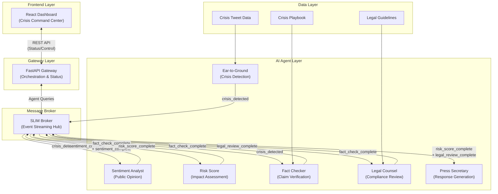
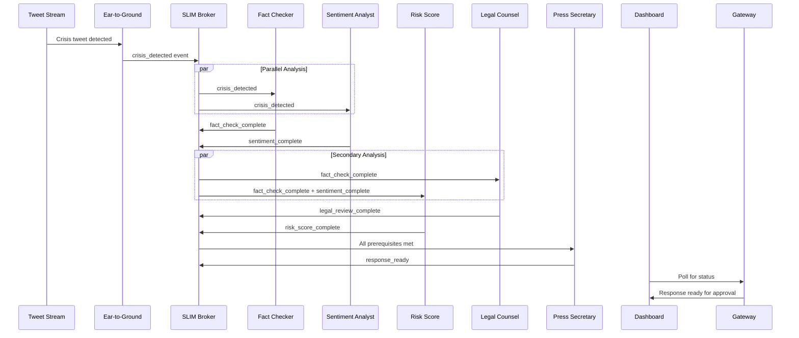

# Orbit – Event-Driven Crisis Management Architecture

## System Overview

The Orbit system uses an **event-driven, dependency-based architecture** where AI agents coordinate through SLIM transport messaging to handle PR crises autonomously.

## High-Level Architecture

## Event-Driven Crisis Flow

## Agent Communication Topics

| Topic | Publisher | Subscribers | Purpose |
|-------|-----------|-------------|---------|
| `orbit.crisis.detected` | Ear-to-Ground | Fact Checker, Sentiment Analyst | Initial crisis trigger |
| `orbit.fact.complete` | Fact Checker | Legal Counsel, Risk Score | Claim verification results |
| `orbit.sentiment.complete` | Sentiment Analyst | Risk Score | Public opinion analysis |
| `orbit.risk.complete` | Risk Score | Press Secretary | Crisis severity assessment |
| `orbit.legal.complete` | Legal Counsel | Press Secretary | Legal risk evaluation |
| `orbit.response.ready` | Press Secretary | Gateway | Draft response available |

## Technology Stack

### Communication Layer
- **SLIM Broker**: Central event streaming hub (ghcr.io/agntcy/slim:0.3.15)
- **AGNTCY App SDK**: Agent framework and transport abstraction
- **Dual Bridge Pattern**: A2A (requests) + Broadcast (events)

### AI Agent Layer  
- **LangGraph**: Agent workflow orchestration
- **LangChain**: LLM integration framework
- **OpenAI GPT**: Language model for analysis and generation
- **Python**: Agent implementation language

### Frontend Layer
- **React + TypeScript**: Interactive crisis dashboard
- **Tailwind CSS**: Terminal-style UI design
- **Vite**: Development and build tooling

### Infrastructure
- **Docker Compose**: Multi-service orchestration
- **FastAPI**: Gateway REST API
- **Uvicorn**: ASGI server for Python services 