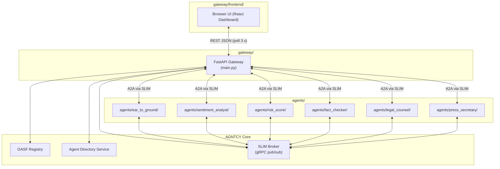

# Orbit – System Architecture

```mermaid
graph TD
  subgraph "gateway/frontend/"
    BrowserUI["Browser UI (React Dashboard)"]
  end

  subgraph "gateway/"
    Gateway["FastAPI Gateway\n(main.py)"]
  end

  subgraph AGNTCY Core
    OASF["OASF Registry"]
    Directory["Agent Directory Service"]
    SLIM["SLIM Broker\n(gRPC pub/sub)"]
  end

  subgraph "agents/"
    Ear["agents/ear_to_ground/"]
    Sent["agents/sentiment_analyst/"]
    Risk["agents/risk_score/"]
    Fact["agents/fact_checker/"]
    Legal["agents/legal_counsel/"]
    Press["agents/press_secretary/"]
  end

  BrowserUI <--> |"REST JSON (poll 3 s)"| Gateway
  Gateway <--> |"A2A via SLIM"| Ear
  Gateway <--> |"A2A via SLIM"| Sent
  Gateway <--> |"A2A via SLIM"| Risk
  Gateway <--> |"A2A via SLIM"| Fact
  Gateway <--> |"A2A via SLIM"| Legal
  Gateway <--> |"A2A via SLIM"| Press

  Gateway <--> Directory
  Gateway <--> OASF
  Gateway <--> SLIM
  
  Ear <--> SLIM
  Sent <--> SLIM
  Risk <--> SLIM
  Fact <--> SLIM
  Legal <--> SLIM
  Press <--> SLIM
``` 