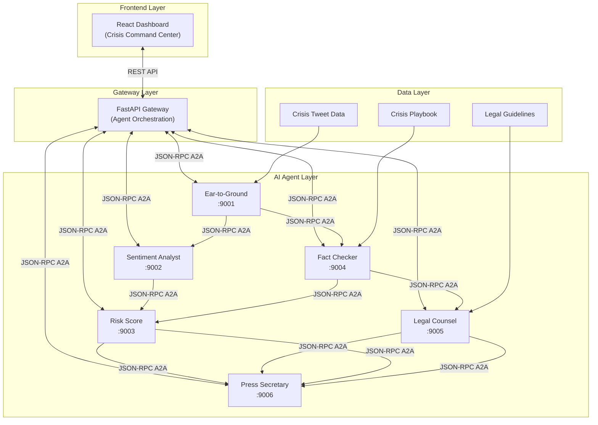
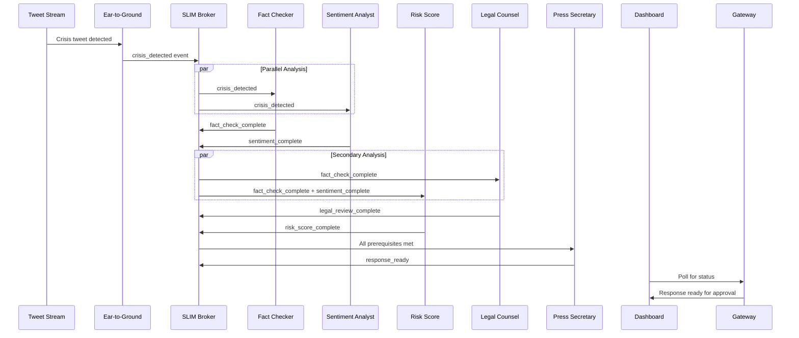

# Orbit – Direct Agent Communication Architecture

## System Overview

The Orbit system uses a **direct agent communication architecture** where AI agents coordinate through JSON-RPC A2A calls to handle PR crises autonomously. The gateway provides REST APIs for frontend monitoring and control.

## High-Level Architecture

## Event-Driven Crisis Flow

## Agent Communication Endpoints

| Agent | Port | A2A Endpoint | Purpose |
|-------|------|--------------|---------|  
| Ear-to-Ground | 9001 | `http://ear-to-ground:9001/` | Crisis detection and coordination |
| Sentiment Analyst | 9002 | `http://sentiment-analyst:9002/` | Public opinion analysis |
| Risk Score | 9003 | `http://risk-score:9003/` | Crisis severity assessment |
| Fact Checker | 9004 | `http://fact-checker:9004/` | Claim verification |
| Legal Counsel | 9005 | `http://legal-counsel:9005/` | Legal risk evaluation |
| Press Secretary | 9006 | `http://press-secretary:9006/` | Response generation |
| Gateway | 8000 | `http://gateway:8000/api/` | REST API for frontend |

## Technology Stack

### Communication Layer
- **JSON-RPC A2A**: Direct agent-to-agent communication
- **A2AStarletteApplication**: HTTP server for each agent
- **AGNTCY App SDK**: Agent framework and request handling
- **REST API**: Gateway-to-frontend communication

### AI Agent Layer  
- **LangGraph**: Agent workflow orchestration
- **LangChain**: LLM integration framework
- **OpenAI GPT**: Language model for analysis and generation
- **Python**: Agent implementation language

### Frontend Layer
- **React + TypeScript**: Interactive crisis dashboard
- **Tailwind CSS**: Terminal-style UI design
- **Vite**: Development and build tooling

### Infrastructure
- **Docker Compose**: Multi-service orchestration
- **FastAPI**: Gateway REST API
- **Uvicorn**: ASGI server for Python services 